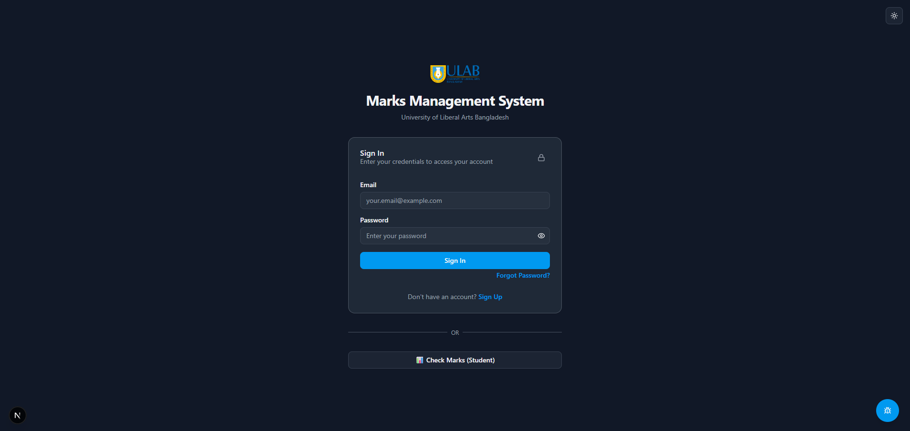
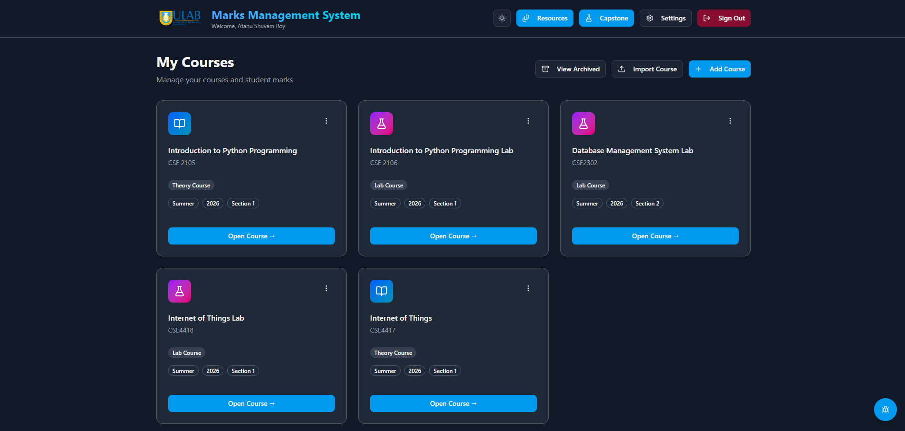

# ULAB Marks Management System

> ULAB Marks Management System is the internal academic operations platform for the University of Liberal Arts Bangladesh.

This Docsify site is the GitHub Pages documentation entry point. It is intentionally lightweight, uses the live Docsify runtime, and keeps the docs easy to update without a build step.

## Deep Dive

The code-level documentation now lives in dedicated pages:

- [Architecture](architecture.md)
- [Authentication](auth.md)
- [Courses](courses.md)
- [Data Models](data-models.md)
- [Capstone](capstone.md)
- [Developer Notes](developer.md)

## Overview

The application centralizes marks entry, attendance tracking, capstone management, shared resources, and admin workflows in a single Next.js app.

It is organized around authenticated routes for students, admins, capstone reviewers, and course management tasks. MongoDB/Mongoose powers the persistent data layer, while NextAuth handles session-based access.

## What You Will Find Here

- Product overview and platform scope
- Route map for student and admin areas
- Setup and deployment notes
- Screenshots from the live application
- Maintenance references for the repository

## Screenshots

### Sign-in

The sign-in screen is the first entry point for most users.

### Dashboard

The dashboard is the main post-login workspace for academic and administrative tasks.

## Core Areas

### Authentication

The app includes sign-in, sign-up, forgot-password, and reset-password flows for general users, plus a separate admin sign-in route.

### Dashboard and Admin

The dashboard area exposes general operations, archived data, admin tools, and capstone management entry points.

### Marks and Courses

Course, exam, and mark data are stored in MongoDB and surfaced through course-specific routes and grading utilities.

### Attendance

Attendance flows support session creation and student check-in via session code.

### Capstone

Capstone routes are split by role and evaluation type, covering supervisor, evaluator, report, weekly journal, and peer-review workflows.

### Resources and Files

Resource browsing and file access are handled through dedicated routes for shared materials and personal file spaces.

## Route Map

- `/auth/signin`, `/auth/signup`, `/auth/forgot-password`, `/auth/reset-password`
- `/admin/signin`, `/admin/dashboard`, `/admin/settings`
- `/dashboard`, `/dashboard/admin-portal`, `/dashboard/capstone-portal`, `/dashboard/archived`
- `/attendance/checkin/[sessionCode]`
- `/course/[id]`, `/course/[id]/urms-grades`
- `/capstone`, `/capstone/supervisor`, `/capstone/evaluator`
- `/capstone/supervisor/[semester]/[category]/weekly-journal`
- `/capstone/supervisor/[semester]/[category]/peer`
- `/capstone/supervisor/[semester]/[category]/report`
- `/capstone/evaluator/[category]/report`
- `/project/[courseId]`
- `/resources/[[...folderPath]]`
- `/student/check-marks`

## Setup

1. Install dependencies with `npm install`.
2. Set `MONGODB_URI` and any auth or email secrets required by your environment.
3. Run `npm run dev` for local development.
4. Open `/auth/signin` to test the login flow.

## Maintenance Notes

- Versioning is handled by a CI-based release flow rather than local git hooks.
- Database and index maintenance scripts live in the repository root and `scripts/` folder.
- Spreadsheet import/export and grading logic are centralized in utility modules.
- The deeper source walkthrough is split across the docs pages listed above.

## Deployment Notes

This site is intended to be published from the `docs/` folder on GitHub Pages.

Keep screenshots and other static assets inside `docs/assets/` so the site remains self-contained.
